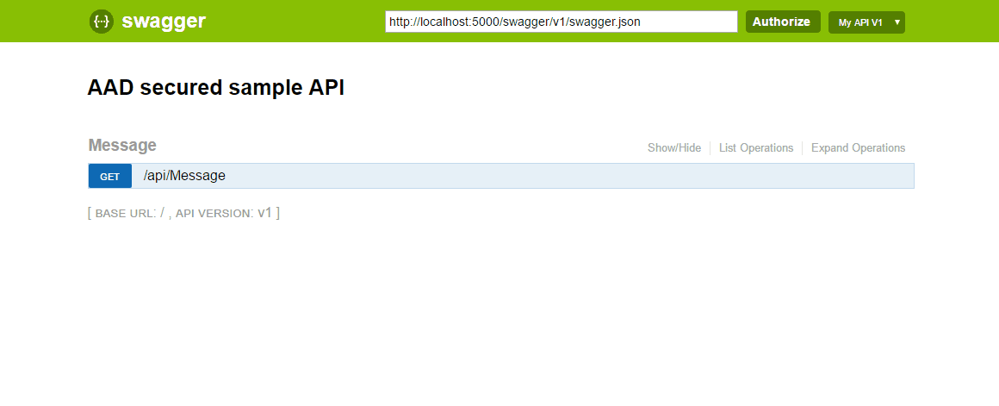
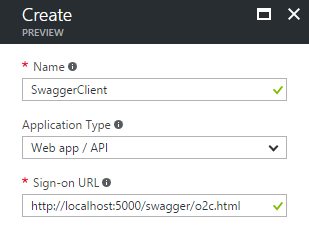
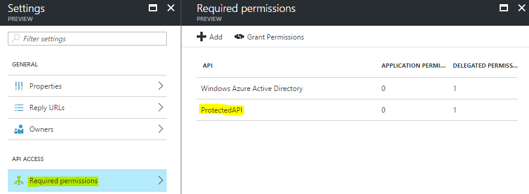
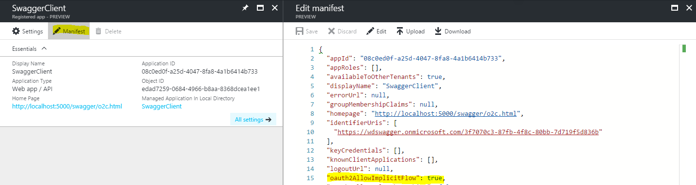

# Swagger Azure Active Directory Extension 
Seamlessly extends the [swashbuckle swagger-ui](https://github.com/domaindrivendev/Swashbuckle) to invoke your Azure AD protected ASP.NET Core Web API applications.


```csharp
public void ConfigureServices(IServiceCollection services)
{
    // ...
    services.AddSwaggerGen(c =>
    {
        // ...
        c.ConfigureAAD("<API ClientId>", "<TenantId>");
    });
}
```
```csharp
public void Configure(IApplicationBuilder app, IHostingEnvironment env, ILoggerFactory loggerFactory)
{
    // ...
    app.UseSwaggerUI(c =>
    { 
        // ...
        c.ConfigureAAD("<API ClientId>", "<Swagger-UI ClientId>");
    });
}
```
# Build and run
The example *SwaggerAAD.API* within this repository is ready to run. All you need is a installed [.NET Core CLI](https://www.microsoft.com/net/download/core):

- Restore the dependencies of the project using ```dotnet restore```.
- Run the project using ```dotnet run```.
- Navigate to [http://localhost:5000/swagger/](http://localhost:5000/swagger/). 
- Click the Authorize button on the top. 
- Mark the resource and hit the Authorize button. 
- Sign-in using the user ```whiteduck@wdswagger.onmicrosoft.com``` with the password ```wd123swagger!```




# Getting Started
The swagger-ui is basically a client that invokes your Web API therefore you have to create a new AAD Application for it and grant it permissions to call your API. Steps:
- Create an Azure AD Application
- Grant the app permission to your API
- Enable the OAuth2 implicit flow

## Create the swagger-ui Azure AD Application
- Navigate to [App registrations](https://portal.azure.com/#blade/Microsoft_AAD_IAM/ActiveDirectoryMenuBlade/RegisteredApps) within the Azure portal and click the *Add* button. 
- Enter a *friendly name* for the swagger application (e. g. SwaggerClient)
- Select *Web app /API* as the Application Type
- For the Sign-on URL, enter the swagger URL of your API and append ```/o2c.html``` to it. (e. g. ```http://localhost:5000/swagger/o2c.html```)
<br />

<!---->

## Grant the Swagger client application permission to your API
You have created an Azure Active Directory application that represents your swagger client. The application now requires access to your API:
- Navigate to [App registrations](https://portal.azure.com/#blade/Microsoft_AAD_IAM/ActiveDirectoryMenuBlade/RegisteredApps) within the Azure portal and select your swagger client application.
- Choose the *Required permission* Within the *Settings* blade. 
- Click  on *Add* -> *Select an API*. Within the search field type the name of your API application (e. g. *ProtectedAPI*) and select it. 
- Click on the *Select permission* section and then click on *Access <YourAPI>* (e. g. *Access ProtectedAPI*) and confirm it using the *select* and *done* button.

<!---->

## Enable the OAuth2 implicit flow
Since the Whiteduck.Swagger.AADExtension uses the [OAuth2 implicit flow](http://oauthlib.readthedocs.io/en/latest/oauth2/grants/implicit.html) to obtain an access token for your API, you have to set the ```oauth2AllowImplicitFlow``` property to ```true```:
- Navigate to [App registrations](https://portal.azure.com/#blade/Microsoft_AAD_IAM/ActiveDirectoryMenuBlade/RegisteredApps) within the Azure portal and select your swagger client application.
- Click on the *Manifest* button and change the value of the ```oauth2AllowImplicitFlow``` property to ```true```:

<!---->